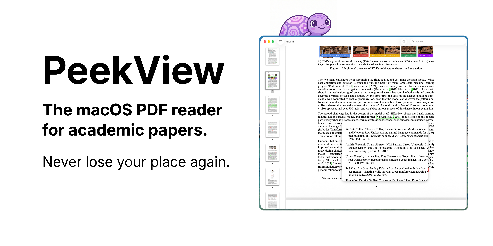

# PeekView



A macOS PDF reader built for academic papers. Click any in-document reference link and a popover appears showing the target page — no scrolling, no losing your place.

## Features

- **Peek references** — Click an internal link (e.g. a citation or figure reference) to preview the target page in a popover
- **Multi-window** — Open multiple papers simultaneously, each in its own window
- **Thumbnail sidebar** — Resizable page thumbnail navigator synced with the main view
- **Text search** — Debounced, parallelized full-text search with result highlighting and navigation
- **Keyboard shortcuts** — `Cmd+F` find, `Enter` next search result

## Requirements

- macOS 14.0+
- Xcode 15.4+

## Getting Started

```bash
open PeekView.xcodeproj
```

Set your development team under the PeekView target's Signing & Capabilities, then build and run with **Cmd+R**.

## PDF Handler

PeekView registers as an alternate PDF viewer. To set it as your default, right-click any PDF in Finder > Get Info > Open With > select PeekView > Change All.

## Project Structure

```
PeekView/
├── PeekViewApp.swift           # App entry point, document-based window management
├── ContentView.swift           # Main UI, state management, search
├── PeekablePDFView.swift       # Custom PDFView subclass (peek popover logic)
├── PDFKitView.swift            # SwiftUI wrapper for PDFKit
├── ThumbnailSidebarView.swift  # Sidebar page thumbnails
├── Info.plist                  # PDF document type registration
└── PeekView.entitlements       # Sandbox & file access permissions
```

## Tech Stack

- Swift + SwiftUI
- PDFKit (no external dependencies)
